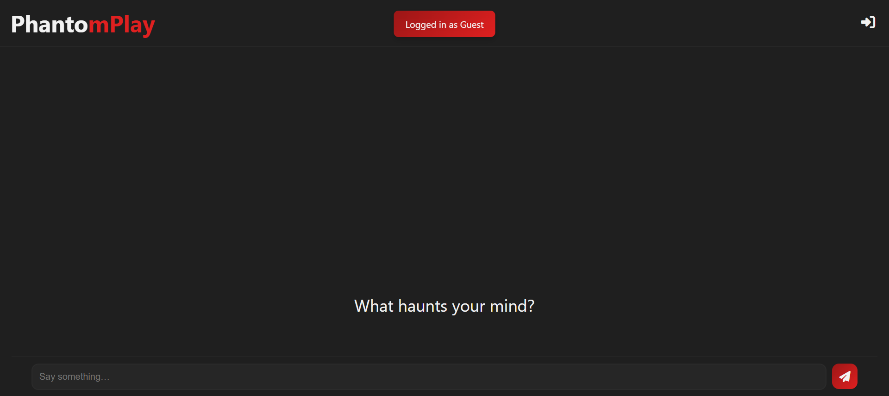
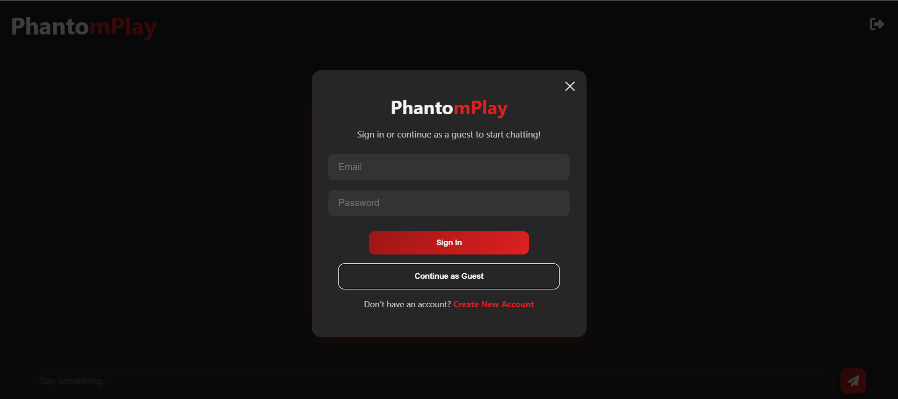

# 🧠 PhantomPlay — Conversational AI Chatbot  

## 🚀 Overview  
PhantomPlay is an end-to-end conversational AI chatbot with **memory and personality**.  
It provides two modes of interaction:  

- **Guest Mode** → Temporary chat memory (session ends when you leave).  
- **Logged-in Mode** → Persistent conversation history stored in a database.  

The chatbot is built with **FastAPI, LangChain, and Google Generative AI**, featuring secure authentication, smooth UI/UX, and a session-based memory system.  

---

## ✨ Features  
- 🔹 **Guest Access** → Try the chatbot without creating an account.  
- 🔹 **User Authentication** → Signup/Login with secure password hashing.  
- 🔹 **Persistent Memory** → Logged-in users get conversation history stored in SQL.  
- 🔹 **Temporary Memory** → Guest users have in-memory chat that resets.  
- 🔹 **Multi-user Support** → Multiple users can chat simultaneously (current DB works, but not yet optimized for scale).  
- 🔹 **LLM Integration** → Context-aware, natural conversations with Google GenAI.  
- 🔹 **UI/UX** → Modals for login/signup, responsive chat interface.  
- 🔹 **Local Hosting** → Runs on `localhost` with FastAPI (deployment-ready).  

---

## 🛠 Tech Stack  
- **Backend** → Python, FastAPI  
- **Frontend** → HTML, CSS, JavaScript  
- **Database** → SQLite (via SQLAlchemy)  
- **AI Framework** → LangChain  
- **LLM** → Google Generative AI  

---

## 🚀 Future Improvements  
- 📦 Dockerization for deployment.  
- 🗂 Add vector database for RAG-based knowledge grounding.  
- ⏳ TTL for conversation history → configure retention (e.g., keep chats for 1 week, auto-clean old logs).  
- 🌍 Scalable multi-user support with robust database setup.  
- 🔎 Web search integration for fetching latest news.  
- ☁️ Hosting on cloud platforms (e.g., AWS, GCP, Azure, or Railway).  

---

## 🤝 Contributing
This is primarily a personal project, but feel free to **fork the repository** and experiment with it. Contributions, suggestions, or improvements are always welcome!
